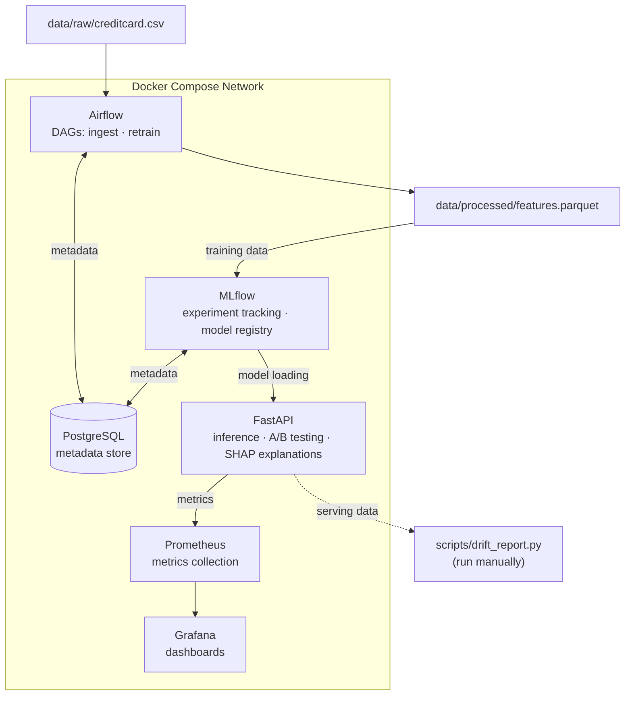

# ML Fraud Detection Platform

[](https://github.com/Liuck27/ml-fraud-detection-platform/actions/workflows/ci.yml)

End-to-end fraud detection with MLOps best practices: imbalanced data handling,
experiment tracking, A/B model testing, explainable predictions, and drift monitoring.

> **New here?** Read the [project wiki](docs/explanation/README.md) for an in-depth,
> file-by-file explanation of every component.

---

## The Problem

- **Imbalanced data** — fraud is 0.17% of transactions. Accuracy is meaningless; a model that always predicts "not fraud" gets 99.8% accuracy.
- **Cost-sensitive decisions** — a missed fraud (false negative) costs real money; a false alarm (false positive) frustrates customers. The right threshold depends on business context.
- **Evolving patterns** — fraud patterns shift over time. Models need monitoring and retraining when data distributions drift.

---

## Architecture



| Service | Role | Port |
|---------|------|------|
| PostgreSQL | Metadata store for Airflow + MLflow | 5432 |
| Airflow | Orchestrates ingestion and retraining | 8080 |
| MLflow | Experiment tracking + model registry | 5000 |
| FastAPI | Inference API, A/B testing, SHAP | 8000 |
| Prometheus | Scrapes metrics from FastAPI | 9090 |
| Grafana | Dashboards for latency, fraud rate, A/B split | 3000 |

---

## Tech Stack

| Layer | Tools |
|-------|-------|
| Orchestration | Apache Airflow 2.7, Docker Compose |
| ML & Data | scikit-learn, XGBoost, PyTorch 2.1, pandas, imbalanced-learn |
| Experiment Tracking | MLflow 2.9 (experiments + model registry) |
| Serving | FastAPI + Uvicorn, Pydantic v2 |
| Explainability | SHAP (TreeExplainer for XGBoost) |
| Monitoring | Prometheus, Grafana, Evidently |
| CI | GitHub Actions (lint + typecheck + test) |

---

## Quick Start

**Prerequisites:** Docker Desktop, Python 3.11, Git Bash or WSL2 (Windows), Kaggle account.

> **Local-only defaults.** This stack is intended to run on localhost. The Airflow admin user is seeded as `admin:admin` in `docker-compose.yml`, and `.env.example` ships `change_me_*` placeholders for Postgres, Airflow, and Grafana. Rotate all of these before exposing any port beyond your machine.

```bash
# 1. Clone and configure
git clone https://github.com/Liuck27/ml-fraud-detection-platform.git
cd ml-fraud-detection-platform
cp .env.example .env
# Edit .env — fill in KAGGLE_USERNAME + KAGGLE_KEY + generate AIRFLOW__CORE__FERNET_KEY

# 2. Download the dataset (~144 MB)
make venv && make download-data

# 3. Start all services
docker compose up -d
# Wait ~60s for Airflow and MLflow to initialise

# 4. Run the data ingestion pipeline
# Trigger the 'data_ingestion' DAG in Airflow UI → http://localhost:8080
# (user: airflow, password: airflow)

# 5. Train both models
make venv-training
bash scripts/run_training.sh
# MLflow UI → http://localhost:5000 — experiments and registered models appear here

# 6. Make your first prediction
curl -s -X POST http://localhost:8000/predict \
  -H "Content-Type: application/json" \
  -d '{
    "transaction_id": "demo-001",
    "features": {
      "V1": -1.36, "V2": -0.07, "V3": 2.54, "V4": 1.38,
      "V5": -0.34, "V6": 0.46, "V7": 0.24, "V8": 0.10,
      "V9": 0.36, "V10": 0.09, "V11": -0.55, "V12": -0.62,
      "V13": -0.99, "V14": -0.31, "V15": 1.47, "V16": -0.47,
      "V17": 0.21, "V18": 0.03, "V19": 0.40, "V20": 0.25,
      "V21": -0.02, "V22": 0.28, "V23": -0.11, "V24": 0.07,
      "V25": 0.13, "V26": -0.19, "V27": 0.13, "V28": -0.02,
      "Amount": 149.62, "Time": 7200
    }
  }' | python -m json.tool
```

---

## Key Features

- **Imbalanced data handling** — SMOTE oversampling + `scale_pos_weight` in XGBoost; evaluation on PR-AUC (more honest than ROC-AUC on 0.17% fraud rate)
- **Two model approaches** — XGBoost (supervised, gradient boosted trees) and PyTorch Autoencoder (unsupervised anomaly detection trained on legit transactions only)
- **A/B testing** — deterministic hash routing (`hash(transaction_id) % 100`) so the same transaction always routes to the same model; split ratio configurable via env var
- **Explainability** — every `/predict` response includes top SHAP feature contributions explaining why the transaction was or wasn't flagged
- **Drift detection** — Evidently `DataDriftPreset` comparing training vs. serving distributions; run `make drift-report` to generate an HTML report
- **Monitoring** — Grafana dashboards for request rate, fraud rate %, p99 latency, and A/B traffic split; Prometheus alerting rules for anomalous conditions

---

## API Reference

### `POST /predict`

```json
{
  "transaction_id": "550e8400-e29b-41d4-a716-446655440000",
  "features": { "V1": -1.36, "..": "...", "Amount": 149.62, "Time": 7200 }
}
```

Response includes `fraud_probability`, `is_fraud`, `model_name`, `model_version`, `explanation.top_features`, and `latency_ms`.

### `POST /predict/batch`

Up to 1,000 transactions in one request. Returns per-transaction predictions without SHAP explanations (for throughput).

### `GET /health` · `GET /models` · `GET /metrics`

Health check with loaded model status, model registry info, and Prometheus metrics endpoint.

---

## Design Decisions

### What's in scope and why

| Decision | Rationale |
|----------|-----------|
| **Airflow for orchestration** | Multi-step DAGs (ingest → features → train → register) benefit from dependency management, retries, and a UI to inspect failures |
| **Two model types** | XGBoost is the practical choice for tabular fraud detection. The autoencoder shows a different paradigm — unsupervised anomaly detection that doesn't need fraud labels |
| **SHAP explanations** | In fraud detection, "why was this flagged?" matters for compliance and customer trust. SHAP is the industry standard |
| **PR-AUC alongside ROC-AUC** | On datasets this imbalanced, ROC-AUC can look great even when the model is mediocre. PR-AUC tells a more honest story |
| **Evidently as a standalone script** | Drift detection is important to demonstrate awareness of, but integrating a full drift pipeline into Airflow would be overkill here |

### What's deliberately out of scope

| Omitted | Why |
|---------|-----|
| **Kafka / streaming** | Would add 3+ containers for a synthetic demo stream. The ML signal-to-noise ratio drops significantly |
| **Feast feature store** | The dataset is a single static CSV — a feature store solves training-serving skew across multiple data sources, a problem that doesn't exist here |
| **Kubernetes** | Single-node Docker Compose is honest for a local portfolio project. K8s would add YAML complexity without demonstrating anything the project needs |
| **Isolation Forest** | Three models is one too many. XGBoost + Autoencoder already covers supervised + unsupervised. A third model adds diminishing returns |

---

## Development

### Running checks locally

```bash
make check          # format-check + lint + typecheck + unit tests (full CI equivalent)
make lint           # ruff check only
make format         # black formatter
make typecheck      # mypy on serving/ and training/
make test           # all unit tests
make test-serving   # serving/tests/ only
make test-integration  # integration tests (requires docker compose up)
```

### Virtual environments

Each service has an isolated venv — never mix them:

```bash
make venv           # root dev tools (lint, format, CI)
make venv-training  # ML training dependencies
make venv-serving   # FastAPI serving dependencies
make venv-airflow   # Airflow (slow — ~10 min)
make venv-evidently # Evidently drift reporting
```

### Screenshots

_Grafana dashboard (request rate, fraud rate, p99 latency, A/B split):_
> Add screenshot here after running `docker compose up -d && make train`

_MLflow experiment comparison (XGBoost runs with logged metrics):_
> Add screenshot here after `bash scripts/run_training.sh`

_SHAP explanation output (top feature contributions per prediction):_
> Add screenshot here after calling `POST /predict`

_Airflow DAG graph view (data_ingestion and retrain DAGs):_
> Add screenshot here from http://localhost:8080
