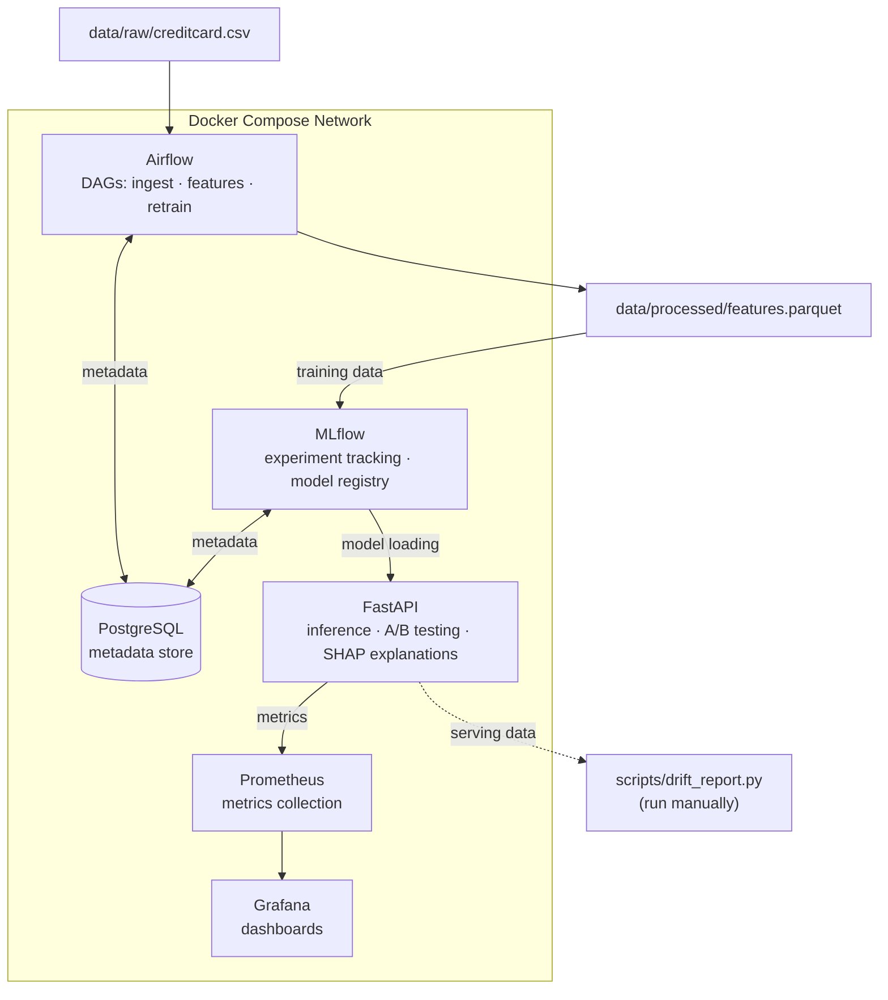

# ML Fraud Detection Platform, Implementation Plan

## 1. Project Overview

### What It Does

A fraud detection platform that handles the full ML lifecycle: data ingestion, feature engineering, model training with experiment tracking, real-time inference via REST API, and monitoring with drift detection. Covers practical MLOps on a real-world imbalanced classification problem.

### Why This Problem

Fraud detection is one of the most practical ML applications in industry. It touches on concerns that matter in real roles:
- **Imbalanced data handling**: fraud is <1% of transactions. Naive models get 99% accuracy by predicting "not fraud" every time.
- **Cost-sensitive decisions**: a missed fraud (false negative) costs real money; a false alarm (false positive) frustrates customers. The right threshold depends on business context.
- **End-to-end thinking**: training a model is not enough. It needs to be served, monitored, and retrained when patterns shift.

### Architecture



### Services

| Service | Role | Port | Talks To |
|---------|------|------|----------|
| **PostgreSQL** | Metadata store for Airflow + MLflow | 5432 | Airflow, MLflow |
| **Airflow** (webserver + scheduler) | Orchestrates ingestion, feature engineering, retraining | 8080 | PostgreSQL, MLflow |
| **MLflow** | Experiment tracking, model registry | 5000 | PostgreSQL, FastAPI |
| **FastAPI** | Inference API, A/B testing, SHAP explanations | 8000 | MLflow, Prometheus |
| **Prometheus** | Scrapes metrics from FastAPI | 9090 | FastAPI, Grafana |
| **Grafana** | Dashboards for request rate, latency, fraud rate | 3000 | Prometheus |

---

## 2. Tech Stack

### Core Infrastructure

| Tool | Purpose |
|------|---------|
| Docker + Docker Compose | Run all services locally with one command |
| PostgreSQL 15 | Shared metadata backend for Airflow and MLflow |
| Makefile | Common commands (lint, test, train, up/down) |

### ML & Data

| Tool | Purpose |
|------|---------|
| Python 3.11 | Primary language |
| pandas | Data loading and feature engineering |
| scikit-learn | Preprocessing, metrics, baselines |
| XGBoost | Main classifier (gradient boosting) |
| PyTorch | Autoencoder for anomaly detection |
| SHAP | Model explainability, why did it flag this transaction? |
| imbalanced-learn | SMOTE oversampling for class imbalance |

### MLOps & Serving

| Tool | Purpose |
|------|---------|
| MLflow | Experiment tracking + model registry with champion/challenger |
| Apache Airflow | Pipeline orchestration (ingest → features → retrain) |
| FastAPI + Uvicorn | REST API for inference |
| Pydantic | Request/response validation |

### Monitoring

| Tool | Purpose |
|------|---------|
| Prometheus | Metrics collection |
| Grafana | Dashboards (request rate, p99 latency, fraud rate, A/B split) |
| Evidently | Data drift detection (standalone script, generates HTML report) |
| prometheus-fastapi-instrumentator | Auto-instruments FastAPI with Prometheus metrics |

---

## 3. Data Strategy

### Dataset

**Kaggle Credit Card Fraud Detection**
- 284,807 transactions, 492 frauds (0.172%)
- 30 features: `Time`, `Amount`, and 28 PCA-transformed features (`V1`-`V28`)
- Target: `Class` (0 = legit, 1 = fraud)
- Download to `data/raw/creditcard.csv` (gitignored)

### Engineered Features

Added on top of the raw V1-V28 + Amount:
- `amount_log`, log1p(Amount), reduces skew
- `amount_zscore`, Z-score normalized Amount
- `hour_of_day`, derived from Time field
- `is_night`, 22:00-06:00 flag
- `v1_v2_interaction`, V1 * V2 interaction term

No rolling windows or aggregations, the dataset has no user/card grouping to roll over.

### Class Imbalance Strategy

The dataset is 99.83% legitimate / 0.17% fraud:

1. **Training**: SMOTE oversampling + `scale_pos_weight` in XGBoost
2. **Evaluation**: Precision, recall, F1, AUC-ROC, and PR-AUC (more informative than ROC-AUC on imbalanced data)
3. **Threshold tuning**: Optimize on the precision-recall curve based on a cost ratio (missed fraud costs more than a false alarm)
4. **Anomaly detection**: The autoencoder learns "normal" transactions only, fraud shows up as high reconstruction error

---

## 4. Component Breakdown

### a) Data Ingestion & Feature Engineering (Airflow)

Orchestrates data loading, validation, and feature computation. The retraining DAG chains data validation → feature engineering → model training → model registration, that multi-step dependency with failure handling is Airflow's sweet spot.

**DAGs:**
- `data_ingestion_dag.py`: validate CSV → compute features → write `data/processed/features.parquet`
- `retrain_dag.py`: trigger training scripts → evaluate → register new model in MLflow (if it beats champion)

### b) Model Training & Experiment Tracking (MLflow)

**Two models, different approaches:**

1. **XGBoost Classifier** (champion), supervised, trained on all labeled data with SMOTE + `scale_pos_weight`
2. **PyTorch Autoencoder** (challenger), unsupervised anomaly detection, trained on legitimate transactions only; fraud = high reconstruction error (MSE above threshold); architecture: Input(30) → 64 → 32 → 16 → 32 → 64 → Output(30)

XGBoost is the reliable workhorse for tabular data. The autoencoder shows a different angle: unsupervised anomaly detection that doesn't need fraud labels. Comparing them via A/B testing mirrors how teams evaluate model alternatives in practice.

All runs log hyperparameters, metrics, and model artifacts to MLflow. Registry aliases: `champion` (production), `challenger` (staging). Autoencoder exported via TorchScript.

**Evaluation metrics:** Precision, Recall, F1, AUC-ROC, PR-AUC, confusion matrix, cost-weighted score.

### c) Model Serving API (FastAPI)

**Endpoints:**
- `POST /predict`, single transaction → fraud score + SHAP explanation
- `POST /predict/batch`, up to 1000 transactions
- `GET /health`, service status + loaded models
- `GET /models`, model versions, roles, metrics
- `GET /metrics`, Prometheus metrics

**A/B Testing:** Deterministic hash routing, `hash(transaction_id) % 100 < challenger_pct`. Same transaction always routes to the same model. Split ratio configurable via env var (default: 80/20).

**SHAP Explanations:** Top contributing features on every `/predict` response (e.g. "V14 pushed score up by 0.3"). Uses SHAP TreeExplainer for XGBoost. Important for compliance and trust.

**Model loading:** On startup, load champion + challenger from MLflow registry. Fallback to local artifact cache if MLflow is unreachable.

### d) Monitoring & Drift Detection

**Prometheus metrics:**
- `inference_latency_seconds` (histogram), per model
- `inference_total` (counter), per model, per prediction class
- `inference_errors_total` (counter)
- `ab_test_assignments_total` (counter), per model variant

**Grafana dashboard (4 panels, provisioned via JSON):** Request rate, fraud rate %, p99 latency, A/B traffic split.

**Drift detection (`scripts/drift_report.py`):** Standalone ~50-line script, run manually. Compares training vs. recent serving data using Evidently `DataDriftPreset`, outputs HTML to `data/reports/`. Not integrated into Airflow, it's a diagnostic tool.

---

## 5. Directory Structure

```
ml-fraud-detection-platform/
├── .github/workflows/
│   └── ci.yml
├── docker-compose.yml
├── Makefile
├── .env.example
├── .gitignore
├── plan.md
├── README.md
│
├── data/
│   ├── raw/                       # creditcard.csv (gitignored)
│   ├── processed/                 # features.parquet
│   └── reports/                   # Evidently drift reports
│
├── airflow/
│   ├── Dockerfile
│   ├── requirements.txt
│   ├── dags/
│   │   ├── data_ingestion_dag.py
│   │   └── retrain_dag.py
│   └── plugins/
│       └── feature_engineering.py
│
├── training/
│   ├── train_xgboost.py
│   ├── train_autoencoder.py
│   ├── evaluate.py
│   ├── model_registry.py
│   ├── requirements.txt
│   └── notebooks/
│       └── eda.ipynb
│
├── serving/
│   ├── Dockerfile
│   ├── requirements.txt
│   ├── app/
│   │   ├── main.py
│   │   ├── config.py
│   │   ├── schemas.py
│   │   ├── routes/
│   │   │   ├── predict.py
│   │   │   ├── health.py
│   │   │   └── models.py
│   │   └── models/
│   │       ├── loader.py
│   │       ├── ab_testing.py
│   │       └── explainer.py
│   └── tests/
│       ├── conftest.py
│       ├── test_predict.py
│       └── test_ab_testing.py
│
├── monitoring/
│   ├── grafana/provisioning/
│   │   ├── dashboards/
│   │   │   ├── dashboard.yml
│   │   │   └── fraud_detection.json
│   │   └── datasources/
│   │       └── datasource.yml
│   ├── prometheus/
│   │   └── prometheus.yml
│   └── alerting/
│       └── rules.yml
│
├── scripts/
│   ├── download_data.py
│   ├── drift_report.py
│   └── run_training.sh
│
└── tests/
    ├── integration/
    │   └── test_pipeline_e2e.py
    └── conftest.py
```

---

## 6. Implementation Phases

### Phase 1: Project Scaffold & Infrastructure Foundation

**Deliverables:** Docker Compose + PostgreSQL + Makefile + `.env` / `.env.example`

**Acceptance Criteria:**
- `docker compose up postgres` starts successfully
- Can connect to PostgreSQL on `localhost:5432`

---

### Phase 2: Data Ingestion & EDA

**Files:** `scripts/download_data.py`, `training/notebooks/eda.ipynb`, `airflow/plugins/feature_engineering.py`, `airflow/dags/data_ingestion_dag.py`

**Acceptance Criteria:**
- `make download-data` produces `data/raw/creditcard.csv` (284,807 rows)
- DAG runs end-to-end in Airflow UI, produces `data/processed/features.parquet`
- EDA notebook renders cleanly

---

### Phase 3: Model Training with MLflow

**Files:** `training/evaluate.py`, `training/train_xgboost.py`, `training/train_autoencoder.py`, `training/model_registry.py`, `scripts/run_training.sh`, `Dockerfile.mlflow`

**Acceptance Criteria:**
- MLflow UI at `localhost:5000` shows experiments with logged metrics
- XGBoost AUC-ROC ≥ 0.95; both models registered with correct aliases
- `bash scripts/run_training.sh` completes without error

---

### Phase 4: FastAPI Serving + A/B Testing + Explainability

**Files:** `serving/app/` (config, schemas, routes, models/loader, ab_testing, explainer), serving tests

**Acceptance Criteria:**
- `GET /health` returns 200 with loaded models
- `POST /predict` returns fraud score + model used + SHAP explanation
- `make test-serving` passes

---

### Phase 5: Monitoring + Drift Detection

**Files:** `monitoring/prometheus/prometheus.yml`, `monitoring/grafana/provisioning/`, `monitoring/alerting/rules.yml`, `scripts/drift_report.py`

**Acceptance Criteria:**
- Grafana at `localhost:3000` shows live metrics from the API
- `make drift-report` produces an HTML report in `data/reports/`

---

### Phase 6: CI + Integration Tests + README

**Files:** `.github/workflows/ci.yml`, `airflow/dags/retrain_dag.py`, `tests/integration/test_pipeline_e2e.py`, `README.md`

**Acceptance Criteria:**
- CI passes on push to dev/main
- `make test-integration` passes with services running
- README quickstart works for a fresh clone (≤10 commands to first prediction)

---

## 7. Testing Strategy

### Unit Tests

| Component | Test File | What's Tested |
|-----------|-----------|---------------|
| Feature Engineering | `airflow/tests/test_feature_engineering.py` | Each transform function in isolation |
| Evaluation Utils | `training/tests/test_evaluate.py` | Metric computation, threshold selection |
| A/B Testing | `serving/tests/test_ab_testing.py` | Routing determinism, approximate split ratio |
| Prediction Endpoints | `serving/tests/test_predict.py` | Happy path, validation errors, batch limits |

### Integration Tests

| Test | What's Verified |
|------|----------------|
| `tests/integration/test_pipeline_e2e.py` | POST /predict returns valid response; /metrics has expected counters; MLflow has champion alias |

### CI (GitHub Actions)

- **Trigger:** push/PR to `main` or `dev`
- **Jobs:** `lint` (ruff + black --check), `test` (pytest), `typecheck` (mypy on serving/ + training/)

```bash
make test                # All unit tests
make test-serving        # serving/tests/ only
make test-training       # training/ tests only
make test-integration    # Integration (requires services up)
make check               # format-check + lint + typecheck + test
```

---

## 8. Design Decisions & Trade-offs

### What's in scope and why

| Decision | Rationale |
|----------|-----------|
| **Airflow for orchestration** | Multi-step DAGs (ingest → features → train → register) benefit from dependency management, retries, and a UI to inspect failures. |
| **Two model types** | XGBoost is the practical choice for tabular fraud detection. The autoencoder shows a different paradigm (unsupervised anomaly detection). Comparing them via A/B testing is how teams actually evaluate alternatives. |
| **SHAP explanations** | In fraud detection, "why was this flagged?" matters for compliance and customer trust. SHAP is the standard tool. |
| **Evidently as a script** | Drift detection is important to show awareness of, but a full drift pipeline would be overkill. A standalone script that generates an HTML report is honest and useful. |
| **PR-AUC alongside ROC-AUC** | On datasets this imbalanced, ROC-AUC can look great even when the model is mediocre. PR-AUC tells a more honest story. |

### What's deliberately out of scope

| Omitted | Why |
|---------|-----|
| **Kafka / streaming** | Would add 3+ containers for a synthetic demo stream. Impressive infrastructure, but ML signal-to-noise ratio drops. Noted in README as a potential extension. |
| **Feast feature store** | The dataset is a single static CSV. A feature store solves training-serving skew across multiple data sources, that problem doesn't exist here. |
| **Kubernetes** | Single-node Docker Compose is honest for the actual scale. K8s adds YAML complexity without adding anything this project needs. |
| **Isolation Forest** | XGBoost + Autoencoder already shows supervised + unsupervised. A third model adds diminishing returns. |
