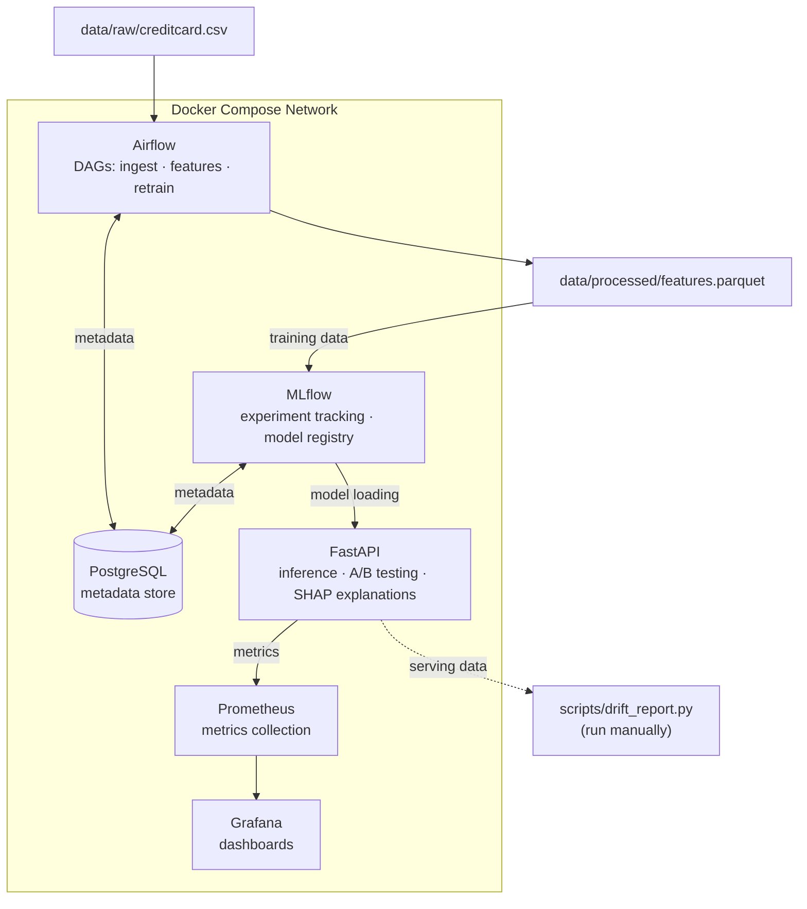

# ML Fraud Detection Platform — Implementation Plan

## 1. Project Overview

### What It Does

A fraud detection platform that handles the full ML lifecycle: data ingestion, feature engineering, model training with experiment tracking, real-time inference via REST API, and monitoring with drift detection. Built to demonstrate practical MLOps skills on a real-world imbalanced classification problem.

### Why This Problem

Fraud detection is one of the most practical ML applications in industry. It highlights skills that matter in real roles:
- **Imbalanced data handling** — fraud is <1% of transactions. Naive models get 99% accuracy by predicting "not fraud" every time.
- **Cost-sensitive decisions** — a missed fraud (false negative) costs real money; a false alarm (false positive) frustrates customers. The right threshold depends on business context.
- **End-to-end thinking** — training a model is not enough. It needs to be served, monitored, and retrained when patterns shift.

### Architecture



### Services

| Service | Role | Port | Talks To |
|---------|------|------|----------|
| **PostgreSQL** | Metadata store for Airflow + MLflow | 5432 | Airflow, MLflow |
| **Airflow** (webserver + scheduler) | Orchestrates ingestion, feature engineering, retraining | 8080 | PostgreSQL, MLflow |
| **MLflow** | Experiment tracking, model registry | 5000 | PostgreSQL, FastAPI |
| **FastAPI** | Inference API, A/B testing, SHAP explanations | 8000 | MLflow, Prometheus |
| **Prometheus** | Scrapes metrics from FastAPI | 9090 | FastAPI, Grafana |
| **Grafana** | Dashboards for request rate, latency, fraud rate | 3000 | Prometheus |

---

## 2. Tech Stack

### Core Infrastructure

| Tool | Purpose |
|------|---------|
| Docker + Docker Compose | Run all services locally with one command |
| PostgreSQL 15 | Shared metadata backend for Airflow and MLflow |
| Makefile | Common commands (lint, test, train, up/down) |

### ML & Data

| Tool | Purpose |
|------|---------|
| Python 3.11 | Primary language |
| pandas | Data loading and feature engineering |
| scikit-learn | Preprocessing, metrics, baselines |
| XGBoost | Main classifier (gradient boosting) |
| PyTorch | Autoencoder for anomaly detection |
| SHAP | Model explainability — why did it flag this transaction? |
| imbalanced-learn | SMOTE oversampling for class imbalance |

### MLOps & Serving

| Tool | Purpose |
|------|---------|
| MLflow | Experiment tracking + model registry with champion/challenger |
| Apache Airflow | Pipeline orchestration (ingest → features → retrain) |
| FastAPI + Uvicorn | REST API for inference |
| Pydantic | Request/response validation |

### Monitoring

| Tool | Purpose |
|------|---------|
| Prometheus | Metrics collection |
| Grafana | Dashboards (request rate, p99 latency, fraud rate, A/B split) |
| Evidently | Data drift detection (standalone script, generates HTML report) |
| prometheus-fastapi-instrumentator | Auto-instruments FastAPI with Prometheus metrics |

---

## 3. Data Strategy

### Dataset

**Kaggle Credit Card Fraud Detection**
- 284,807 transactions, 492 frauds (0.172%)
- 30 features: `Time`, `Amount`, and 28 PCA-transformed features (`V1`–`V28`)
- Target: `Class` (0 = legit, 1 = fraud)
- Download to `data/raw/creditcard.csv` (gitignored)

### Engineered Features

```python
# Added by the feature pipeline on top of raw V1–V28 + Amount
{
    "amount_log": float,             # log1p(Amount) — reduces skew
    "amount_zscore": float,          # Z-score normalized Amount
    "hour_of_day": int,              # Derived from Time field
    "is_night": bool,                # 22:00–06:00 flag
    "v1_v2_interaction": float,      # V1 * V2 interaction term
}
```

These are straightforward transforms. No rolling windows or aggregations — the dataset has no user/card grouping to roll over, so those would be synthetic and misleading.

### Class Imbalance Strategy

The dataset is 99.83% legitimate / 0.17% fraud. We handle this at multiple levels:

1. **Training**: SMOTE oversampling + `scale_pos_weight` in XGBoost
2. **Evaluation**: Never report accuracy alone. Use precision, recall, F1, AUC-ROC, and PR-AUC (precision-recall AUC is more informative than ROC-AUC on imbalanced data)
3. **Threshold tuning**: Optimize the decision threshold on the precision-recall curve based on a cost ratio (missed fraud costs more than a false alarm)
4. **Anomaly detection**: The autoencoder learns "normal" transactions only — fraud shows up as high reconstruction error, naturally handling the imbalance

---

## 4. Component Breakdown

### a) Data Ingestion & Feature Engineering (Airflow)

**Purpose:** Orchestrate data loading, validation, and feature computation.

**Why Airflow for this?** The retraining DAG chains together data validation → feature engineering → model training → model registration. That multi-step dependency with failure handling is Airflow's sweet spot. A single script could do it, but wouldn't give you retry logic, scheduling, or a UI to inspect failed runs.

**DAGs:**
- `data_ingestion_dag.py`: validate CSV → compute features → write `data/processed/features.parquet`
- `retrain_dag.py`: trigger training scripts → evaluate → register new model in MLflow (if it beats champion)

**Files:**
```
airflow/
├── dags/
│   ├── data_ingestion_dag.py
│   └── retrain_dag.py
├── plugins/
│   └── feature_engineering.py    # Pure functions, testable independently
├── requirements.txt
└── Dockerfile
```

### b) Model Training & Experiment Tracking (MLflow)

**Two models, different approaches:**

1. **XGBoost Classifier** — supervised, gradient boosted trees
   - Trained on all labeled data with SMOTE + `scale_pos_weight`
   - Hyperparameters: learning rate, max depth, n_estimators
   - This is the **champion** (primary model)

2. **PyTorch Autoencoder** — unsupervised anomaly detection
   - Trained on legitimate transactions only
   - Fraud = high reconstruction error (MSE above threshold)
   - Architecture: Input(30) → 64 → 32 → 16 → 32 → 64 → Output(30)
   - This is the **challenger** (compared via A/B testing)

**Why both?** XGBoost is the reliable workhorse for tabular data. The autoencoder shows a different angle — unsupervised anomaly detection that doesn't need fraud labels, which matters when labeled fraud data is scarce. Comparing them via A/B testing demonstrates how teams evaluate model alternatives in practice.

**MLflow integration:**
- All runs log hyperparameters, metrics, and model artifacts
- Model registry with aliases: `champion` (production), `challenger` (staging)
- Autoencoder exported via TorchScript for serving

**Evaluation metrics (for both models):**
- Precision, Recall, F1-score
- AUC-ROC and PR-AUC
- Confusion matrix
- Cost-weighted score (configurable cost ratio for FP vs FN)

**Files:**
```
training/
├── train_xgboost.py
├── train_autoencoder.py
├── evaluate.py                  # Shared: compute_metrics(), plot_curves(), find_threshold()
├── model_registry.py            # MLflow helpers: promote/demote aliases
├── requirements.txt
└── notebooks/
    └── eda.ipynb                # EDA: class balance, distributions, correlations
```

### c) Model Serving API (FastAPI)

**Endpoints:**
- `POST /predict` — single transaction → fraud score + explanation
- `POST /predict/batch` — up to 1000 transactions
- `GET /health` — service status + loaded models
- `GET /models` — model versions, roles, metrics
- `GET /metrics` — Prometheus metrics (auto-instrumented)

**A/B Testing:**
- Deterministic: `hash(transaction_id) % 100 < challenger_pct`
- Same transaction always routes to the same model
- Split ratio configurable via env var (default: 80% champion / 20% challenger)

**SHAP Explanations:**
- The `/predict` response includes top contributing features (e.g., "V14 pushed score up by 0.3, Amount pushed it down by 0.1")
- Uses SHAP TreeExplainer for XGBoost (fast, exact)
- Explains *why* a transaction was flagged — important for compliance and trust

**Model loading:**
- On startup, load champion + challenger from MLflow registry
- Fallback: if MLflow is unreachable, load from local artifact cache

**Files:**
```
serving/
├── app/
│   ├── main.py                  # FastAPI app, startup/shutdown
│   ├── config.py                # Settings via pydantic-settings
│   ├── schemas.py               # Pydantic request/response models
│   ├── routes/
│   │   ├── predict.py           # Prediction endpoints
│   │   ├── health.py            # Health check
│   │   └── models.py            # Model info
│   └── models/
│       ├── loader.py            # MLflow model loading + cache
│       ├── ab_testing.py        # A/B routing logic
│       └── explainer.py         # SHAP explanations
├── requirements.txt
├── Dockerfile
└── tests/
    ├── conftest.py
    ├── test_predict.py
    └── test_ab_testing.py
```

### d) Monitoring & Drift Detection

**Prometheus metrics (exported by FastAPI):**
- `inference_latency_seconds` (histogram) — per model
- `inference_total` (counter) — per model, per prediction class
- `inference_errors_total` (counter)
- `ab_test_assignments_total` (counter) — per model variant

**Grafana dashboard (4 panels, provisioned via JSON):**
- Request rate over time
- Fraud rate %
- p99 inference latency
- A/B traffic split ratio

**Drift detection (`scripts/drift_report.py`):**
- Standalone script (~50 lines), run manually
- Compares training data distribution vs. recent serving data
- Uses Evidently `DataDriftPreset`, outputs HTML to `data/reports/`
- Not integrated into Airflow — it's a diagnostic tool, not a production pipeline

**Files:**
```
monitoring/
├── grafana/provisioning/
│   ├── dashboards/
│   │   ├── dashboard.yml
│   │   └── fraud_detection.json
│   └── datasources/
│       └── datasource.yml
├── prometheus/
│   └── prometheus.yml
└── alerting/
    └── rules.yml               # 2-3 rules: high fraud rate, p99 > 500ms, error spike
scripts/
└── drift_report.py
```

---

## 5. Directory Structure

```
ml-fraud-detection-platform/
├── .github/workflows/
│   └── ci.yml                     # Lint + test + typecheck on push/PR
├── docker-compose.yml
├── Makefile
├── .env.example
├── .gitignore
├── plan.md
├── README.md
│
├── data/
│   ├── raw/                       # creditcard.csv (gitignored)
│   ├── processed/                 # features.parquet
│   └── reports/                   # Evidently drift reports
│
├── airflow/
│   ├── Dockerfile
│   ├── requirements.txt
│   ├── dags/
│   │   ├── data_ingestion_dag.py
│   │   └── retrain_dag.py
│   └── plugins/
│       └── feature_engineering.py
│
├── training/
│   ├── train_xgboost.py
│   ├── train_autoencoder.py
│   ├── evaluate.py
│   ├── model_registry.py
│   ├── requirements.txt
│   └── notebooks/
│       └── eda.ipynb
│
├── serving/
│   ├── Dockerfile
│   ├── requirements.txt
│   ├── app/
│   │   ├── main.py
│   │   ├── config.py
│   │   ├── schemas.py
│   │   ├── routes/
│   │   │   ├── predict.py
│   │   │   ├── health.py
│   │   │   └── models.py
│   │   └── models/
│   │       ├── loader.py
│   │       ├── ab_testing.py
│   │       └── explainer.py
│   └── tests/
│       ├── conftest.py
│       ├── test_predict.py
│       └── test_ab_testing.py
│
├── monitoring/
│   ├── grafana/provisioning/
│   │   ├── dashboards/
│   │   │   ├── dashboard.yml
│   │   │   └── fraud_detection.json
│   │   └── datasources/
│   │       └── datasource.yml
│   ├── prometheus/
│   │   └── prometheus.yml
│   └── alerting/
│       └── rules.yml
│
├── scripts/
│   ├── download_data.py
│   ├── drift_report.py
│   └── run_training.sh
│
└── tests/
    ├── integration/
    │   └── test_pipeline_e2e.py
    └── conftest.py
```

---

## 6. Implementation Phases

### Phase 1: Project Scaffold & Infrastructure Foundation ✅ DONE

**Deliverables:** Docker Compose + PostgreSQL + Makefile + `.env` / `.env.example`

**Acceptance Criteria:**
- `docker compose up postgres` starts successfully
- Can connect to PostgreSQL on `localhost:5432`

---

### Phase 2: Data Ingestion & EDA ✅ DONE

**Files to create:**
- `scripts/download_data.py` — Kaggle API download → `data/raw/creditcard.csv`
- `training/notebooks/eda.ipynb` — class distribution, Amount/Time distributions, correlation heatmap, V-feature analysis
- `airflow/plugins/feature_engineering.py` — pure functions: `log_transform_amount()`, `extract_time_features()`, `compute_interaction_features()`
- `airflow/dags/data_ingestion_dag.py` — PythonOperator chain: load CSV → validate → engineer features → write Parquet

**docker-compose.yml:** Uncomment Airflow block (init, webserver, scheduler)

**Acceptance Criteria:**
- `make download-data` produces `data/raw/creditcard.csv` (284,807 rows)
- DAG runs end-to-end in Airflow UI, produces `data/processed/features.parquet`
- EDA notebook renders cleanly, tells a clear story about the data

---

### Phase 3: Model Training with MLflow

**Files to create:**
- `training/evaluate.py` — `compute_metrics()`, `plot_roc_curve()`, `plot_pr_curve()`, `find_optimal_threshold()`
- `training/train_xgboost.py` — load features, SMOTE, train, log to MLflow, register as `champion`
- `training/train_autoencoder.py` — train on non-fraud only, threshold via PR curve, TorchScript export, register as `challenger`
- `training/model_registry.py` — `promote_to_champion()`, `get_champion_run_id()`
- `scripts/run_training.sh` — run both scripts, fail-fast
- `Dockerfile.mlflow`

**docker-compose.yml:** Uncomment MLflow block

**Acceptance Criteria:**
- MLflow UI at `localhost:5000` shows experiments with logged metrics
- XGBoost AUC-ROC ≥ 0.95; both models registered with correct aliases
- `bash scripts/run_training.sh` completes without error

---

### Phase 4: FastAPI Serving + A/B Testing + Explainability

**Files to create:**
- `serving/app/config.py` — pydantic-settings: MLflow URI, A/B split, model aliases
- `serving/app/schemas.py` — `TransactionRequest`, `PredictionResponse` (includes explanation field)
- `serving/app/models/loader.py` — load champion + challenger from MLflow on startup
- `serving/app/models/ab_testing.py` — deterministic hash routing
- `serving/app/models/explainer.py` — SHAP TreeExplainer for XGBoost, top-k feature contributions
- `serving/app/routes/predict.py` — `POST /predict`, `POST /predict/batch`
- `serving/app/routes/health.py` — `GET /health`
- `serving/app/routes/models.py` — `GET /models`
- `serving/app/main.py` — wire routers, add Prometheus instrumentator
- `serving/Dockerfile`
- Tests: `conftest.py`, `test_predict.py`, `test_ab_testing.py`

**docker-compose.yml:** Uncomment serving block

**Acceptance Criteria:**
- `GET /health` returns 200 with loaded models
- `POST /predict` returns fraud score + model used + SHAP explanation
- `make test-serving` passes

---

### Phase 5: Monitoring + Drift Detection

**Files to create:**
- `monitoring/prometheus/prometheus.yml` — scrape `serving:8000/metrics`
- `monitoring/grafana/provisioning/dashboards/fraud_detection.json` — 4 panels
- `monitoring/alerting/rules.yml` — high fraud rate, p99 latency > 500ms, error spike
- `scripts/drift_report.py` — Evidently drift check, HTML output

**docker-compose.yml:** Uncomment Prometheus + Grafana blocks

**Acceptance Criteria:**
- Grafana at `localhost:3000` shows live metrics from the API
- `make drift-report` produces an HTML report in `data/reports/`

---

### Phase 6: CI + Integration Tests + README

**Files to create:**
- `.github/workflows/ci.yml` — lint (ruff + black), test (pytest), typecheck (mypy)
- `airflow/dags/retrain_dag.py` — orchestrate retraining pipeline
- `tests/integration/test_pipeline_e2e.py` — POST /predict works, /metrics has expected counters, MLflow has champion
- `README.md` — architecture diagram, quickstart, screenshots, design decisions

**Acceptance Criteria:**
- CI passes on push to dev/main
- `make test-integration` passes with services running
- README quickstart works for a fresh clone (≤10 commands to first prediction)

---

## 7. API Contracts

### POST /predict

**Request:**
```json
{
    "transaction_id": "550e8400-e29b-41d4-a716-446655440000",
    "features": {
        "V1": -1.359807,
        "V2": -0.072781,
        "V3": 2.536347,
        "V4": 1.378155,
        "V5": -0.338321,
        "V6": 0.462388,
        "V7": 0.239599,
        "V8": 0.098698,
        "V9": 0.363787,
        "V10": 0.090794,
        "V11": -0.551600,
        "V12": -0.617801,
        "V13": -0.991390,
        "V14": -0.311169,
        "V15": 1.468177,
        "V16": -0.470401,
        "V17": 0.207971,
        "V18": 0.025791,
        "V19": 0.403993,
        "V20": 0.251412,
        "V21": -0.018307,
        "V22": 0.277838,
        "V23": -0.110474,
        "V24": 0.066928,
        "V25": 0.128539,
        "V26": -0.189115,
        "V27": 0.133558,
        "V28": -0.021053,
        "Amount": 149.62
    }
}
```

**Response (200):**
```json
{
    "transaction_id": "550e8400-e29b-41d4-a716-446655440000",
    "fraud_probability": 0.032,
    "is_fraud": false,
    "model_name": "xgboost-champion",
    "model_version": "3",
    "explanation": {
        "top_features": [
            {"feature": "V14", "contribution": -0.28},
            {"feature": "V12", "contribution": -0.15},
            {"feature": "Amount", "contribution": 0.08}
        ]
    },
    "latency_ms": 4.2,
    "timestamp": "2025-01-15T10:30:00Z"
}
```

### POST /predict/batch

**Request:**
```json
{
    "transactions": [
        {"transaction_id": "uuid-1", "features": {"V1": -1.35, "...": "...", "Amount": 149.62}},
        {"transaction_id": "uuid-2", "features": {"V1": 1.19, "...": "...", "Amount": 2.69}}
    ]
}
```

**Response (200):**
```json
{
    "predictions": [
        {
            "transaction_id": "uuid-1",
            "fraud_probability": 0.032,
            "is_fraud": false,
            "model_name": "xgboost-champion",
            "model_version": "3",
            "latency_ms": 4.2
        },
        {
            "transaction_id": "uuid-2",
            "fraud_probability": 0.94,
            "is_fraud": true,
            "model_name": "xgboost-champion",
            "model_version": "3",
            "latency_ms": 3.8
        }
    ],
    "count": 2,
    "total_latency_ms": 8.0,
    "timestamp": "2025-01-15T10:30:00Z"
}
```

### GET /health

**Response (200):**
```json
{
    "status": "healthy",
    "models": {
        "champion": {"name": "xgboost-fraud-detector", "version": "3", "status": "loaded"},
        "challenger": {"name": "autoencoder-fraud-detector", "version": "1", "status": "loaded"}
    },
    "ab_test": {
        "champion_traffic": 0.8,
        "challenger_traffic": 0.2
    }
}
```

### GET /models

**Response (200):**
```json
{
    "models": [
        {
            "name": "xgboost-fraud-detector",
            "version": "3",
            "role": "champion",
            "traffic_percentage": 80,
            "metrics": {"auc_roc": 0.978, "pr_auc": 0.82, "f1": 0.85}
        },
        {
            "name": "autoencoder-fraud-detector",
            "version": "1",
            "role": "challenger",
            "traffic_percentage": 20,
            "metrics": {"auc_roc": 0.952, "pr_auc": 0.74, "f1": 0.78}
        }
    ]
}
```

---

## 8. Testing Strategy

### Unit Tests

| Component | Test File | What's Tested |
|-----------|-----------|---------------|
| Feature Engineering | `airflow/tests/test_feature_engineering.py` | Each transform function in isolation |
| Evaluation Utils | `training/tests/test_evaluate.py` | Metric computation, threshold selection |
| A/B Testing | `serving/tests/test_ab_testing.py` | Routing determinism, approximate split ratio |
| Prediction Endpoints | `serving/tests/test_predict.py` | Happy path, validation errors, batch limits |

### Integration Tests

| Test | What's Verified |
|------|----------------|
| `tests/integration/test_pipeline_e2e.py` | POST /predict returns valid response; /metrics has expected counters; MLflow has champion alias |

### CI (GitHub Actions)

- **Trigger:** push/PR to `main` or `dev`
- **Jobs:** `lint` (ruff + black --check), `test` (pytest), `typecheck` (mypy on serving/ + training/)
- PRs to `main` require all jobs to pass

### Test Commands
```bash
make test                # All unit tests
make test-serving        # serving/tests/ only
make test-training       # training/ tests only
make test-integration    # Integration (requires services up)
make check               # format-check + lint + typecheck + test
```

---

## 9. README Outline

```markdown
# ML Fraud Detection Platform


End-to-end fraud detection with MLOps best practices: imbalanced data handling,
experiment tracking, A/B model testing, explainable predictions, and drift monitoring.

## The Problem
- Credit card fraud is <1% of transactions — accuracy is meaningless
- False negatives cost money, false positives frustrate customers
- Fraud patterns evolve — models need monitoring and retraining

## Architecture
[Mermaid diagram]

## Tech Stack
[Table: tool → purpose]

## Quick Start
1. Clone + copy .env.example → .env
2. Download dataset
3. docker compose up -d
4. Train models
5. Hit the API
(≤10 commands from clone to first prediction)

## Key Features
- **Imbalanced data handling**: SMOTE + cost-sensitive evaluation
- **Two model approaches**: XGBoost (supervised) + Autoencoder (unsupervised anomaly detection)
- **A/B testing**: deterministic routing, compare models on live traffic
- **Explainability**: SHAP-based feature attributions on every prediction
- **Drift detection**: Evidently reports comparing training vs serving distributions
- **Monitoring**: Grafana dashboards for latency, fraud rate, A/B splits

## Design Decisions
- Why XGBoost + Autoencoder (complementary approaches to the same problem)
- Why PR-AUC over ROC-AUC for evaluation (more informative on imbalanced data)
- Why SHAP (compliance, trust, debugging)
- Simplifications made for portfolio context (single-node, no Kubernetes, local Kafka alternative)

## Screenshots
- Grafana dashboard
- MLflow experiment comparison
- SHAP explanation output
- Airflow DAG view
```

---

## 10. Design Decisions & Trade-offs

This section documents deliberate choices — what was included, what was left out, and why.

### What's in scope and why

| Decision | Rationale |
|----------|-----------|
| **Airflow for orchestration** | Multi-step DAGs (ingest → features → train → register) benefit from dependency management, retries, and a UI to inspect failures. A cron + script approach would work but wouldn't demonstrate orchestration skills. |
| **Two model types** | XGBoost is the practical choice for tabular fraud detection. The autoencoder shows a different paradigm (unsupervised anomaly detection). Comparing them via A/B testing is how teams actually evaluate alternatives. |
| **SHAP explanations** | In fraud detection, "why was this flagged?" matters for compliance and customer trust. SHAP is the standard tool. It's a few lines of code but adds real portfolio signal. |
| **Evidently as a script** | Drift detection is important to show awareness of, but a full drift pipeline would be overkill here. A standalone script that generates an HTML report is honest and useful. |
| **PR-AUC alongside ROC-AUC** | On datasets this imbalanced, ROC-AUC can look great even when the model is mediocre. PR-AUC tells a more honest story. Reporting both shows awareness. |

### What's deliberately out of scope

| Omitted | Why |
|---------|-----|
| **Kafka / streaming** | Would add 3+ containers (Zookeeper, Kafka, producer) for a synthetic demo stream. Impressive infrastructure, but the ML signal-to-noise ratio drops. Noted in README as a potential extension. |
| **Go consumer** | Cool polyglot addition, but doesn't serve the ML story. Would be appropriate in a systems engineering portfolio. |
| **Feast feature store** | The dataset is a single static CSV. A feature store solves the "training-serving skew" problem across multiple data sources — that problem doesn't exist here. Using Feast would look forced. |
| **Kubernetes** | Single-node Docker Compose is honest for a local portfolio project. K8s would add YAML complexity without demonstrating anything the project needs. |
| **Isolation Forest** | Three models is one too many for this project. XGBoost + Autoencoder already shows supervised + unsupervised. A third model adds diminishing returns. |

---

## 11. What to Say in an Interview

> **"Tell me about your fraud detection project."**

*"I built a fraud detection platform using the credit card fraud dataset — 284K transactions with only 0.17% fraud. The core challenge was imbalanced data: a naive model gets 99.8% accuracy by never predicting fraud.*

*I trained two models: XGBoost as the primary classifier with SMOTE oversampling, and a PyTorch autoencoder that learns what normal transactions look like and flags anomalies by reconstruction error. Both are tracked in MLflow with full experiment logging.*

*For evaluation, I focused on precision-recall rather than accuracy — because in fraud detection, the cost of missing a fraud is very different from the cost of a false alarm. I added SHAP explanations to every prediction so you can see which features drove the decision.*

*The models are served via FastAPI with A/B testing — deterministic hash routing so the same transaction always goes to the same model. Prometheus and Grafana track latency, fraud rates, and the A/B split. There's also an Evidently drift report to check if the incoming data distribution has shifted from training.*

*The whole thing runs on Docker Compose — Airflow orchestrates the pipeline, MLflow tracks experiments, and everything comes up with one command."*

This covers: data awareness, imbalance handling, cost-sensitive thinking, explainability, serving, monitoring, and infrastructure — without claiming it's something it's not.
